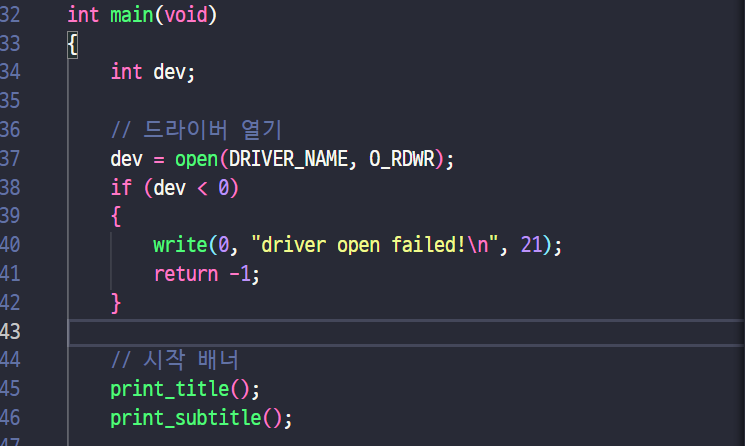

# ⚙️ TermProject 보고서

# 🌊 전체적인 흐름

1. 스위치로 LED 제어 (Mode 1 ~ 4)
2. 스위치간 모드 이동 불가 → 4번 모드인 리셋 스위치를 거쳐야함
3. 사용자 입력으로도 LED 제어 가능

---

# 🧑‍💻 Device Driver: 사용자 입력

### 1. 드라이버 열기

1. `open` 함수로 드라이버를 읽기-쓰기 모드 `(O_RDWR)` 로 엽니다.
2. 제대로 열리지 않았을 때, -1를 반환하므로 오류 메시지를 출력하고 종료합니다.

### 2. 명령어 입력

1. 명령어를 입력받을 `cmd` 변수를 동적할당하고 , read를 통해 데이터를 입력받습니다.
2. 길이가 2이상 (NULL문자 포함) 이거나 read를 실패하면 에러처리 했습니다.

1. switch문을 통해 1, 2, 3, 4 입력을 받고 0은 종료입니다. 이외에는 다시 입력 받도록 했습니다.

1. 3번 모드 실행 시에는 계속 LED 입력을 받아야 하므로 `infinite loop` 를 통해 계속 입력 받도록 했습니다. 
2. 여기서 입력 예외처리를 해주었고, 4번 누르면 `loop` 탈출입니다. 1,2,3은 모듈로 전달되어서 LED를 제어합니다.

---

# 🚖 Device Driver: 데이터 전달

1. open 함수를 호출할 떼, 우리 모듈의 함수를 실행시키기 위해 file_operations 구조체를 선언했습니다.
2. 그리고 커널-유저, 유저-커널 로 데이터를 주고받을 `memory_buffer` 를 전역변수로 설정했습니다.

1. `open` : 디바이스가 열릴 때 호출되며, 메모리를 초기화합니다.
2. `release` : 디바이스가 닫힐 때 호출되며, 할당된 메모리를 해제합니다.

1. `my_dirver_init`: 드라이버 초기화시 호출되며, 디바이스를 등록합니다.
2. `my_driver_exit` : 드라이버 종료시 호출되며, 디바이스를 해제합니다.
3. `DEV_MAJOR_NUMBER` 는 220번으로 `define` 했습니다.

1. `my_driver_write()` : 유저 영역의 데이터를 커널 영역으로 복사하고 곧 바로 LED 제어를 합니다.
2. 복사하기전에 `length` 파라미터를 받아 BUFFER의 크기보다 크면 에러 처리했습니다.
3. `copy_from_user`함수가 가져오기에 성공하면 memory_buffer에 데이터가 담기게 됩니다.
4. 반환 값으로는 복사한 데이터의 길이를 반환합니다.

1. `my_driver_read()` : 커널 영역의 데이터를 유저 영역으로 복사합니다.
2. `ofs` 이 0보다 크면 읽을 데이터가 없음을 나타내고 0를 반환합니다.

1. 유저에서 받은 입력은 `user_interface_handler()` 로 이동하여 LED를 제어합니다.
2. 인터럽트 `irq_handler()` [image.png](https://www.notion.so/157a2acd37608092a363e4572f461c13?pvs=21) 와 기능은 똑같기 때문에 자세한 설명은 아래에서 하도록 하겠습니다.

---

# 💽 모듈 프로그래밍

## 로직

모듈의 로직은 항상 인터럽트 핸들러에 의해 컨트롤 되도록 작성했습니다.

1. 스위치를 누르는 순간 request_irq에 의해 등록된 `irq_handler` 함수가 콜백으로 호출되고 이 함수에 누른 스위치의 인터럽트 번호가 인자로 전달됩니다.
2. irq_handler는 SW[2]번 즉, 3번 모드인 수동 모드가 켜져있는지를 먼저 체크합니다. 수동 모드가 꺼져있다면 각 SW[0], SW[1]에 해당하는 전체 모드와 개별 모드에 대한 함수를 호출합니다.

수동 모드가 켜져있다면 irq_handler는 모드가 리셋될 때까지 각 스위치에 해당하는 led를 켜고 끄는 동작만 수행합니다.

마지막 스위치는 항상 모드를 초기화하는 즉, 리셋 버튼으로 사용했습니다. 리셋 스위치를 제외한 어떤 모드를 호출했을 경우, 리셋 스위치를 다시 누르기 전까지는 다른 스위치를 통해 다른 모드를 작동시킬 수 없도록 설계했습니다.

## 모드별 함수

다음은 모드별로 어떤 함수가 호출되고 어떤 코드를 작성하여 로직을 구성하였는지 기술한 것입니다.

1. 전체 모드 - SW[0]
    
    
    
    1번 스위치인 전체 모드는 인터럽트가 발생했을 때 irq_handler에 의해 `module_led_mode_1` 함수가 호출됩니다. 이 함수는 다른 모드가 켜져있는지 플래그를 확인하고, 아무것도 켜져있지 않다면 즉시 led 4개를 HIGH상태로 바꿉니다. 이후 `timer_module_init_mode1` 함수를 호출합니다.
    
    
    
    이 함수는 타이머를 셋업하고 콜백 주기를 2초로 설정합니다. 이 때 셋업시 등록해줄 타이머 콜백 함수에는 플래그 변수를 이용하여 led를 모두 끄고 켜기를 반복합니다.
    
    
    
2. 개별 모드 - SW[1]
    
    2번 스위치인 개별 모드도 1번 스위치 전체 모드와 동일한 흐름으로 함수를 호출하도록 작성하였습니다.
    
    
    
    `module_led_mode_2` 함수를 첫 번째로 호출하고 다른 모드의 플래그를 체크한 뒤 `timer_module_init_mode2` 함수를 호출한 뒤 타이머 콜백 함수 셋업을 진행합니다. 이 때 콜백의 주기는 2초이며 콜백 함수는 led 배열의 인덱스를 참조하며 led를 껐다 켰다를 반복하는데, 나머지 연산자를 활용하여 led_number 변수의 값이 0 1 2 3 0 1 2 3 이런 방식으로 순환되도록 코드를 작성했습니다.
    
3. 수동 모드 - SW[2]
    
    3번 스위치인 수동 모드는 예외적으로 작동합니다. 해당 모드가 켜져있을 때는 다른 모드를 키지 않도록 인터럽트를 컨트롤 해야하며 동시에 그 인터럽트를 모드 온오프가 아닌 led의 온오프로 연결시켜야 합니다. 따라서 수동 모드는 irq_handler 함수의 조건문을 통해 수동 모드가 켜져있는지 체크한 뒤 스위치 문으로 로직을 처리하도록 작성했습니다.
    
    
    
    모드가 리셋된 상태에서 3번 스위치를 누르면 irq_handler에 의해 `module_led_mode3` 함수가 호출되고 이 함수에서 모드 플래그를 켜줍니다. 그리고 이후에는 모드가 리셋되기 전까지 계속 `irq_handler`의 else 조건문으로 분기됩니다.
    
    
    
    해당 switch 문에서는 `on_off_led_mode3` 함수에 인터럽트 번호에 따라 1 ~ 4번 인덱스를 전달하여 해당 인덱스에 해당하는 led를 껐다 켜기를 반복하도록 작성했습니다. 이 과정에서 버튼이 눌린 스위치에 해당하는 led가 켜져있는지 꺼져있는지 확인하고 이 값을 반전시키기 위해 int형 변수인 `mode3_flag`를 선언하고 이 변수에 비트 연산자를 사용하여 4개의 flag를 컨트롤하도록 하였습니다. 이때 XOR 비트 연산 ^를 사용하여 플래그의 값이 0과 1을 반복하도록 값을 반전시키는데 사용했습니다.
    
    
    
    
    
4. 모드 리셋 - SW[3]
    
    마지막 4번 스위치 모드는 리셋 모드로, 이 스위치를 누를 시에는 모든 동작이 멈추고 모드가 리셋됩니다.
    
    
    
    코드에는 각 모드가 켜져있는지 확인하는 led_flag 배열의 값들을 off 합니다. 그리고 각 모드에 해당되는 필요한 추가 플래그 값들도 모두 0으로 초기화 합니다. 
    

이렇게 마지막 스위치를 리셋 모드로 설정함으로써 다른 모드들 간의 충돌을 막고 오로지 한 모드만 작동되도록 로직을 구성하였습니다.

## 코드 추후 개선사항

현재 로직에서는 모드가 무조건 하나만 켜지고, 어떤 한 모드가 켜져있을 때는 리셋 스위치를 제외한 다른 인터럽트들은 무시하므로 조금 난잡한 플래그들을 정리하고 리셋 모드 함수를 최적화 할 수 있다.’

- 스크린샷
    
    
    
    
    
    
    
    
    
    
    
    
    
    
    
    - 실행화면
    
    
    
    
    
    